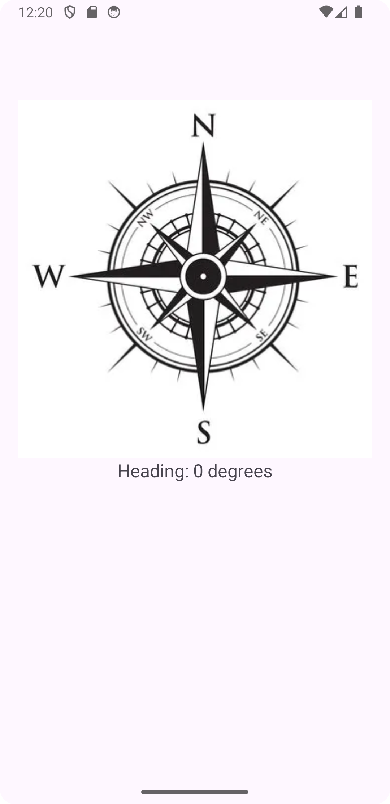

# Compass Android App

A simple and efficient **Compass Android Application** built using **Kotlin**. This app utilizes the device's **magnetic field sensor** and **accelerometer** to determine the direction.

---

## 🚀 Features
- Real-time compass direction updates
- Smooth needle animation
- Supports both **True North** and **Magnetic North**
- Minimal UI
- Works offline

---

## 📱 Screenshots


---

## 🛠️ Technologies Used
- **Kotlin** for Android development
- **SensorManager** for accessing device sensors

---

## 🔧 Installation
### Clone the Repository
```sh
git clone https://github.com/your-username/CompassApp.git
cd CompassApp
```
### Open in Android Studio
1. Open **Android Studio**
2. Select **Open an Existing Project**
3. Navigate to the cloned project folder and open it
4. Let Gradle sync and run the app on an emulator or device

---

## 📄 Usage
1. Open the **Compass App**
2. Rotate your device to see the real-time direction updates
3. The compass needle will point towards the north

---

---

## 📌 TODO
- Add a **calibration feature**
- Implement **location-based declination correction**
- Improve **UI/UX design**

---

